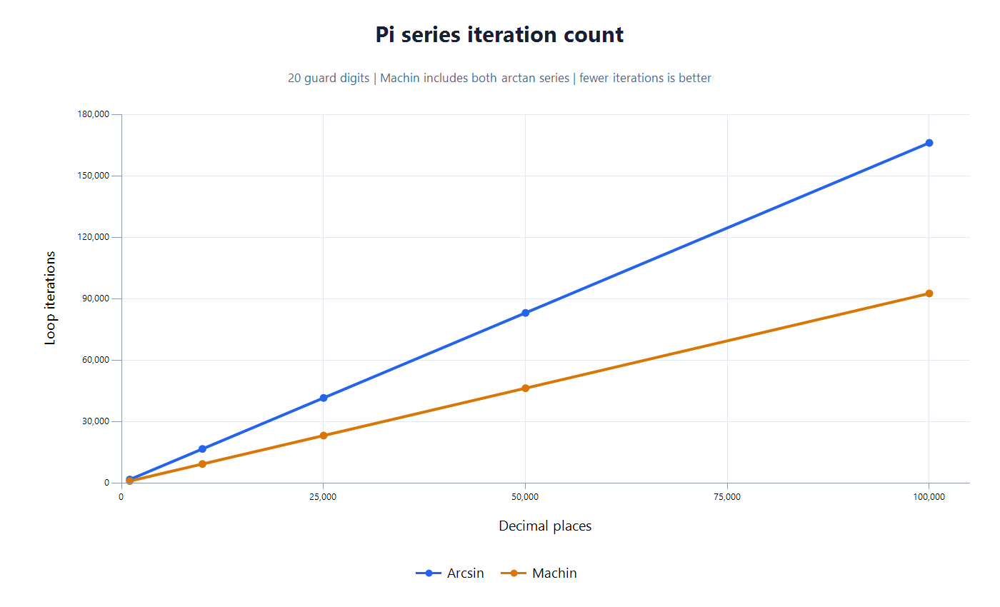

# BigInt9 — Comparing π Algorithms

A C# console application that calculates π using two algorithms and compares their execution times and results. Both implementations use `System.Numerics.BigInteger` with integer arithmetic.

## Requirements

- .NET 10 SDK

## Run

From the repository root:

```powershell
cd BigInt9
dotnet run --configuration Release
```

Run from the `BigInt9` directory because the application reads `PI_100000.txt` relative to the current working directory.

The application calculates **100,000 decimal places** with each algorithm. Each calculation runs in its own `Task.Run` with a separate stopwatch. After `Task.WhenAll` completes, the application prints both execution times and checks each result against the reference file.

Output has this format; execution times depend on the machine and run:

```text
Digits: 100000
Arcsin execution time: <elapsed time>
Arcsin correct: True
Machin execution time: <elapsed time>
Machin correct: True
```

Timing covers the calculation itself, excluding reference-file loading, result verification, and task scheduling before the calculation starts. Since the calculations run concurrently, they share CPU resources; these timings are a comparison from a concurrent run rather than an isolated benchmark.

## Convergence comparison



The graph shows the number of loop iterations performed by the current implementations, including the extra 20 guard digits. These counts are independent of hardware. Machin's count is the sum of the iterations in its two arctangent series.

| Decimal places | Arcsin iterations | Machin iterations (both series) |
|---:|---:|---:|
| 1,000 | 1,692 | 944 |
| 10,000 | 16,640 | 9,274 |
| 25,000 | 41,554 | 23,158 |
| 50,000 | 83,078 | 46,296 |
| 100,000 | 166,126 | 92,575 |

At 100,000 decimal places, Machin performs approximately **44% fewer iterations**. Iterations have different computational costs, so the counts describe convergence rather than execution time. Counts include every loop pass until the scaled numerator or power reaches zero; Arcsin's initial value of `3` is outside its loop.

The [iteration counts](docs/performance.csv), including the separate counts for each Machin series, are included. To regenerate the graph from those counts on Windows, run `powershell.exe -NoProfile -File docs/generate-performance-chart.ps1` from the repository root.

## Algorithms

### Arcsin series

`CalculatePiUsingArcsinSeries` uses:

$$
\pi = 6\arcsin\left(\frac{1}{2}\right)
$$

with the power series:

$$
\arcsin(x) = \sum_{n=0}^{\infty} \frac{(2n)!}{4^n(n!)^2(2n+1)}x^{2n+1}
$$

The implementation derives successive terms through an integer recurrence, avoiding explicit factorial calculations. Its intermediate numerator approaches one quarter of the previous value per iteration.

### Machin's formula

`CalculatePiUsingMachinFormula` uses:

$$
\pi = 16\arctan\left(\frac{1}{5}\right) - 4\arctan\left(\frac{1}{239}\right)
$$

`CalculateScaledArctangent` evaluates each arctangent using:

$$
\arctan(x) = \sum_{n=0}^{\infty} \frac{(-1)^n x^{2n+1}}{2n+1}
$$

Successive powers are calculated by dividing by 25 or 57,121, respectively. These series converge faster than the arcsin series, requiring fewer terms for the same precision.

### Integer precision

Both algorithms work at a scale of `10^(digits + 20)`. The extra 20 decimal places provide a buffer for truncation from integer division. Each loop stops when its scaled power or numerator reaches zero, and the guard digits are removed before returning.

The returned `BigInteger` represents π scaled by `10^digits`, without a decimal separator. Its decimal string is compared with the first `digits + 1` characters of the reference file, including the leading `3`.

## Change the precision

Edit the `digits` constant in `Program.Main`. The default is `100_000`. Checking more decimal places requires a longer reference file.
